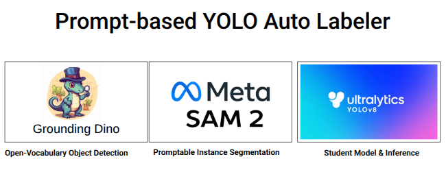

<p align="center">
  
</p>

# Auto-Labeling & YOLO/OBB Dataset Pipeline

Automatically generate bounding box or oriented box labels for object detection datasets using **Grounding DINO** and **SAM2**.

---

## Quick Start 

### Create a virtual environment
```bash
python3 -m venv venv
source venv/bin/activate
```
```bash
# 1. Install dependencies
pip install -r requirements.txt

# 2. Clone and install SAM2
git clone https://github.com/facebookresearch/segment-anything-2.git
cd segment-anything-2 && pip install -e . && cd ..

# 3. Auto-label your images
python auto_label.py \
    --input ./yourdata \
    --output ./yolo_dataset \
    --prompts prompts.yaml \
    --bbox-format yolo

# 4. Train YOLOv8
yolo detect train data=yolo_dataset/dataset.yaml model=yolov8n.pt epochs=100 imgsz=640
```

---

## Extracting Frames from MCAP Files
```bash
python extract_data.py
```

By default, reads from `./data` and writes to `./output`. Override with environment variables:
```bash
DATA_ROOT=./my_data OUTPUT_ROOT=./my_output python extract_data.py
```

### Expected Structure

**Input:**
```
data/
├── class_name_1/
│   └── recording.mcap
└── class_name_2/
    └── recording.mcap
```

**Output:**
```
output/
├── class_name_1/
│   └── rgb/
└── class_name_2/
    └── rgb/
```

The output is ready for `auto_label.py --input ./output`.

---

## Project Files

| File | Description |
|------|-------------|
| `extract_data.py` | Extract RGB/depth frames from MCAP files. |
| `auto_label.py` | Main auto-labeling script. Generates YOLO or OBB labels from images. |
| `prompts.yaml` | Text prompts corresponding to each class. Required for Grounding DINO. |
| `view_dataset.py` | Optional visualization tool for verifying labels. |

---

## Auto-Labeling Usage
```bash
python auto_label.py \
    --input ./output \
    --output ./yolo_dataset \
    --prompts prompts.yaml \
    --bbox-format yolo
```

### Options

| Option | Description |
|--------|-------------|
| `--bbox-format yolo` | Axis-aligned YOLO boxes |
| `--bbox-format obb` | Rotated oriented bounding boxes |
| `--device cuda` | Use GPU if available (defaults to CPU) |

---

## Dataset Structure

After running `auto_label.py`:
```
yolo_dataset/
├── images/
│   ├── train/
│   └── val/
├── labels/
│   ├── train/
│   └── val/
└── dataset.yaml
```

---

## Visualizing Generated Labels
```bash
python view_dataset.py --data ./yolo_dataset --prompts ./prompts.yaml
```

---

## Training YOLO
```bash
pip install ultralytics

yolo detect train \
    data=yolo_dataset/dataset.yaml \
    model=yolov8n.pt \
    epochs=100 \
    imgsz=640
```

| Model | Description |
|-------|-------------|
| `yolov8n.pt` | Nano (fastest) |
| `yolov8s.pt` | Small |
| `yolov8m.pt` | Medium |
| `yolov8l.pt` | Large |
| `yolov8x.pt` | Extra Large (most accurate) |

---

## Notes

- Ensure `prompts.yaml` matches all class names in your dataset
- By default, every 10th image is processed; adjust `files[::10]` in `auto_label.py` if needed
- GPU acceleration is highly recommended

---
